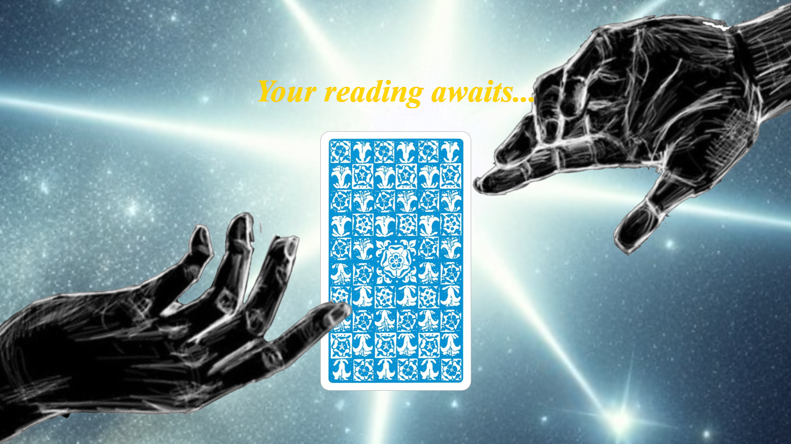

# 
TAROT TIME

## :star: Table of Contents

        

        CLICK TO ENLARGE
        

        :memo: <a href="#description">Description</a>
         
        :sunny: <a href="#features">Features & Highlights</a>
         
        :computer: <a href="#design">Brainstorming & Design</a>
         
        :floppy_disk: <a href="#implementation">Implementation</a>
         
        :sweat_smile: <a href="#challenges">Overcoming Challenges</a>
         
        :sparkles: <a href="#authors">Authors</a>

## :memo: Description
For our T3 end-of-trimester project, we were tasked with building a custom website based on the theme of animation. After brainstorming, our team landed on the idea of a tarot card reading experience. We were excited by the challenge of animating card spreads, card flips, and integrating these animations with stored data for personalized readings. Using the skills we developed throughout the trimester, we collaborated to bring this concept to life!

It's Tarot Time!

## :sunny: Features & Highlights

These are the features of our website:
* Landing page with an eye-catching animation
* Simulated tarot reading utilizing animations and API calls
* Detailed breakdown of each revealed card's significance to the reading

## :computer: Brainstorming & Design

The team drew inspiration from the iconic Rider-Waite Tarot Deck, appreciating its timeless design and symbolism. This served as the foundation for our site's overall aesthetic.

For the color palette, we explored a celestial theme featuring shades of blue and gold, complemented by purple accents. Purple was particularly appealing due to its harmony with the yellow tones often found in Rider-Waite cards. Together, these colors created a cohesive and visually pleasing combination.

Our design goals were centered on delivering a celestial, dark aesthetic that feels immersive while ensuring the site remains intuitive and easy to navigate for users.

[Link to the mockup Design](https://app.uizard.io/prototypes/LOl1W8mjZncLzq9VwlWM/player/preview)

## :floppy_disk: Implementation

Our site was built using a combination of HTML, CSS, and JavaScript to achieve both its design and functionality.
## :sweat_smile: Overcoming Challenges

We quickly discovered that animation was no simple task. Since none of us had animated on this scale, the animation workload was divided, with Jacob handling landing page and card flip animations, and Jaylen handling the animation of cards during the reading.

Due to the nature of the Rider-Waite tarot illustrations featuring some nudity, it was deemed necessary to censor several cards. Jacob was tasked with editing these illustrations for an all-ages appropriate aesthetic.

Jaylen was instrumental in the front-end design process, creating a framework that would expedite the workflow for the entire team, and handling the majority of front-end interactivity during the reading.

Tamara was the back-end specialist for this project and diligently worked through the whole design process to ensure that the API implementation worked just right. Thanks to her hard work, the design and interactivity of the front-end was given form, allowing cards to actually be revealed from a virtual deck.

Thanks to everyone's hard hours of labor dedicated to designing this website, we are quite happy with what we have accomplished!

## :sparkles: Authors

**Jaylen Perez**
- Github: [@Jaylenperez](https://github.com/Jaylenperez)

**Tamara Walling**
- Github: [@Scoob1](https://github.com/Scoob1)

**Jacob Griffith**
- Github: [@JacobGriffith1](https://github.com/JacobGriffith1)
- "My name is Jacob Griffith, and I'm ready to help you build your next website! Whether you're looking for a professional design for a law practice, something inviting for a restaurant, a fun landing page for a tourist attraction, or anything in between, I'm your guy for the job. I am very adaptable, so I can provide whatever web design services you require to reach your goals! Feel free to send me an email at jacobgriffith6339@gmail.com to get in touch. I'll get back to you in 2-3 days, or sooner when possible."